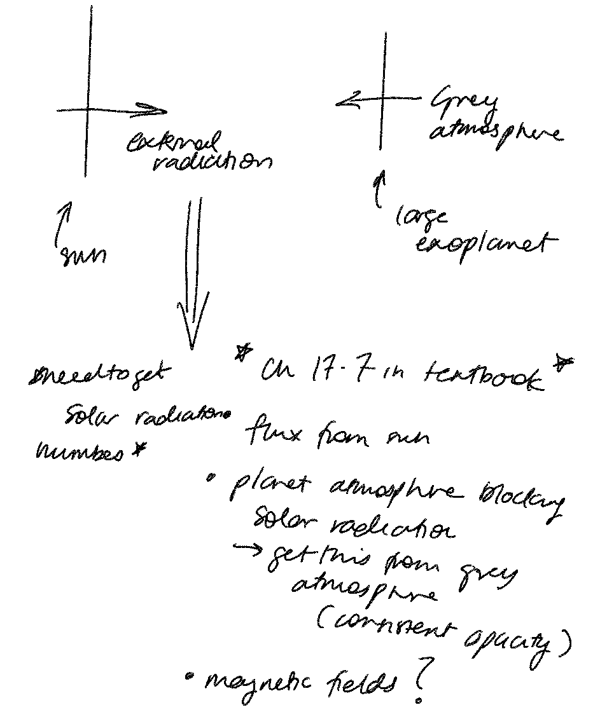

# Project 10 Group Logbook

## 26-08-2025

- Git repo has been set up, still ironing out some issues so that everyone can see everything
- Have discussed the problem and approaches, sketched out the plan and ideas as below

## 28 - 08 - 2025 - minutes from class time 3-5pm

- Zotero project created so we can easily group all sources together
- Discussing possible methods for tackling project
- Textbook has grey atmospher approximation for externally irradiated atmospheres
- planet structure considered to be gas giant, Vernica provided a paper that discusses processes of externally irradiated atmosphere of gas giant
    - Model from paper takes non-LTE effects into account, might be too complex of a starting point
- Looking at provided code, specifically structure.py file. We plan too look over the code to see how it works
- We aim to neglect convection due to the problem being too complex to add, possibly might come back to it if we have time.

For pseudo-grey model, we need to know the temp, g and rho of planet. Albedo of the planet remains fixed and will come from literature. We aim to find how the temperature of the planet is affected by the external radiation field.

We discuss 3 main tasks to split between the three of this:

- Fixing the temperature code so that it works
- Finding literature values for temperature, g and density of exoplanets
- Changing code so that it becomes an exoplanet instead of a star

## 02 - 09 - 2025 - notes from group meeting

At this stage, we have a finalised equation for the simple pseudo-gray model planet atmosphere.

$$T^4(\tau_H)=\frac{\kappa_J}{\kappa_B}\frac{3}{4}T_{eff}^4\left[\tau_H+\frac{1}{\sqrt{3}}+\frac{4W}{3}\left(\frac{T_{irr}}{T_{eff}}\right)^4\right]$$

Where for the pseudo-gray atmosphere, $\kappa_J/\kappa_B=1$, and $W=(r_\ast/D)^2\times{f}$, where $f=1/2$ for the stellar radiation being evenly spread over the hemisphere of the planet. The only part we are unsure about at the moment is $\tau_H$, and we need to look further to understand exactly how it is dependent on the atmosphere of the exoplanet.

We have broken the next part of the project down into three components for us to work on this week:

- Griffin: finish the code for `T_tau`, where an input tau grid outputs temperature
- Vernica: look into $\tau_H$ and apply this to the function, testing the `structure.py` code to get some initial model results
- Nathan: look beyond the grey atmosphere model, into what we need to do to model non-grey atmosphere

## 11 - 09 - 2025 - notes from group meeting

Realised a couple of issues with grey model:

- kappa function defined in existing opac code done from only hydrogen but planet atmosphere mostly helium
  - need to redefine opacity function from first principle i.e. abundance * column density of species
- picket fence model for non-grey atmosphere
  - different way of defining T_Tau, much easier and computationally more viable than defining each individual absorption line
  - will also come up with opacities for non-grey model

For Tuesday, we have divided these two tasks up between the three of us, to try to get closer to a finished grey model and then make some steps towards the non-grey model.

# 16-9-2025 - notes from group meeting and questions for Mike

Solved issue Vernica was having with the Planck function and the irradiated spectrum. Opted to use a closer distance to the star to simulate a hot jupiter due to the irradiation of jupiter being negligible.

Nathan explained the non-grey model, confusion is around the picket fence model and the thermal opacities. The model can be coded up to take the irradiated temperature and the visual opacities. We can manipulate the ratio of thermal opacities (i.e. $R = \kappa_1/\kappa_2$ which are the picket fence opacities $\kappa_1$ and $\kappa_2$) to see how this affects the temperature profile of the planet. 

##### Griffin questions and clarifications for mike: 
In the saha code how are we supposed to know what is being calculated ? 
eg:
where comment in code is:
- ns: A vector of number densities of H, H+, H-, He, He+, He++ in cm^{-3} 

So for ns: does that mean it calculates H, H+, H-, He, He+ and He++ and nothing else ? Does it calculate He- or is H- just a special case and what about the rest of the elements ?
(does the saha equation calculate He- ?)

Also I rembered that in class mike mentioned something about the saha equation being a bit more complicated for molecules [[@soaresNonGaussianThermostatisticalConsiderations2019]] so I went looking and turns out that: "Molecules and molecular ions have other degrees of freedom, like vibration and rotation. Because of that the equation needs to be modified in such a way to take these features into account."
will ask mike and group about saha equation because I think i remember mention of there already being a complex saha equation available 

kappa_cont_H and kappa_cont seem to do pretty much the same thing is that true or am I missing something obvious ? 

My understanding is that for the non grey atmosphere the major part of that will be adjusting the ratio of thermal opacities to visuals,
Are the kappas only related to planet thermal opacties or are they influenced by the irraition as well ? 
$$
T^{4}(\tau_{H})= \frac{\kappa_j}{\kappa_b}\frac{3}{4}T_{eff}^4 (\tau_H+\frac{1}{\sqrt{3}}+\frac{4W}{3}(\frac{T_{irr}}{T_{eff}})^4)
$$

This mess of drawings came from me clarifying my understanding on the non-grey atmosphere and grey atmosphere. As well as my understanding on opacities. And dicussion with Maya about calculating line opacities. 

![[Untitled Notebook-2.jpg]]

![[Untitled Notebook-3.jpg]]
![[Untitled Notebook-4.jpg]]

My understanding of the opacties now:

Continuum opacities they make up the shape of the line and they are the built from the addition of each elements Ionisation transitions and bound-bound transitions

As getting absorption lines one why historically and suggested during our conversation was the random bands model where lines were randomly placed to approximate low-res spectra.

Now If we wanted to do it properly we would have to solve the radiation transport equation numerically. 

But possibly a simpler way to do it due to the time constraints would be to just calculate the major lines individually. 

My understanding on how the simplest way to do that would be using beer lambert's law where: 

Light of wavelength $\lambda$ traversing an absorbing column obeys
$$

I(\lambda) = I_0(\lambda)*(1 - exp(-\tau(\lambda)))

$$
where
$$

\tau(\lambda) \;=\;\int_{z_0}^{\infty} \sigma\!\bigl(\lambda,T(z)\bigr)\,n(z)\,dz

\quad\bigl[\text{dimensionless}\bigr].

$$

* $( I_0(\lambda) )$ – incident irradiance at the cloud‑top interface.

* $( \sigma(\lambda,T) cm^{2})$ – monochromatic absorption cross‑section (lab‑derived).

* $( n(z) ,[\mathrm{cm^{-3}}] )$ – number density profile of the coulmn density from literature 

* $( \tau )$ – optical depth 

And we can calculate this for each line. 

For our crossections databases we can use to get the absorption crossections for the lines come from: 

- **HITRAN** (300 K, IR focus; now expanded to other temps/wavelengths).
- **HITEMP** (high-T extension of HITRAN).

Note -> in my original conversation in the notes above I thought we would be calculating kappa which would then use in our temp profile but I think now the kappa_j and kappa_b are to do with the planets own thermal opacities ????? 

Is that right ? 

On this note I had: 
>[!note]
>Not to sure what to do with the strong line and weak line functions and for now I am going to wait till class to do either He- or He++ as I am not to sure what one. 

I assume its function is to calculate the lines in a more in depth manor then what I suggested above. 