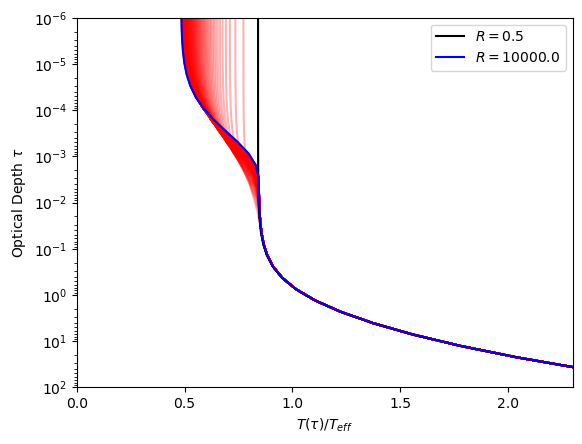
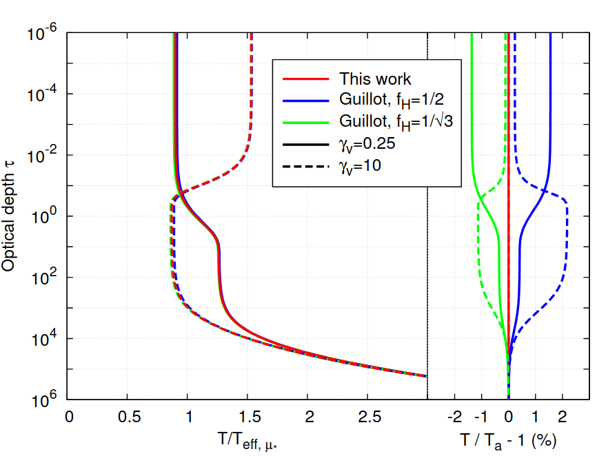
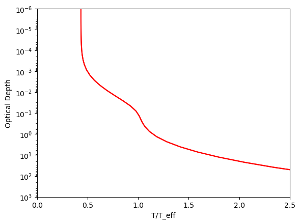
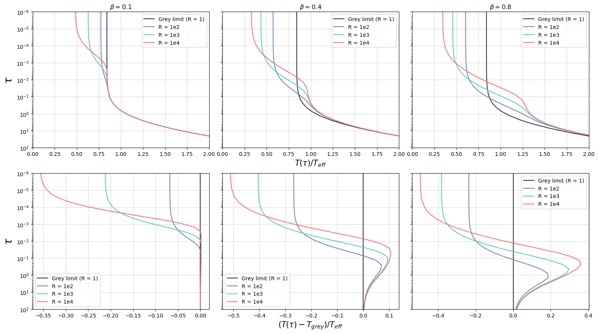
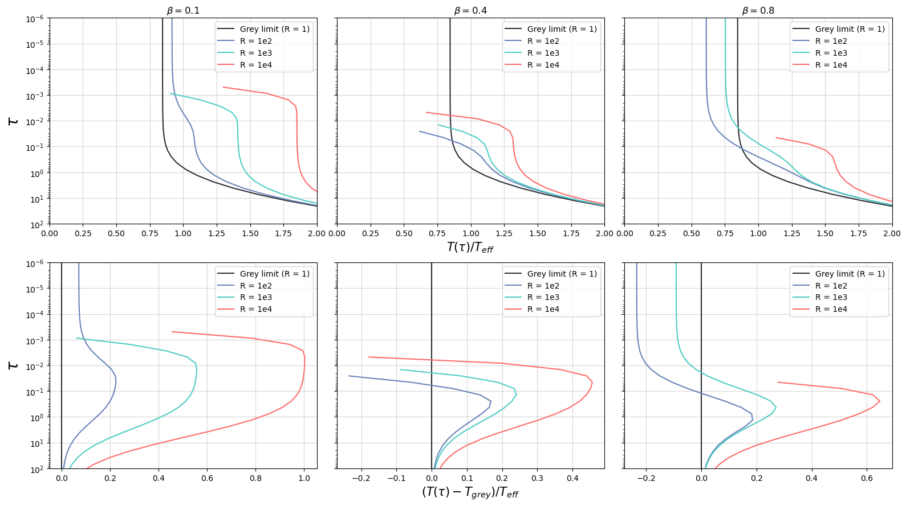
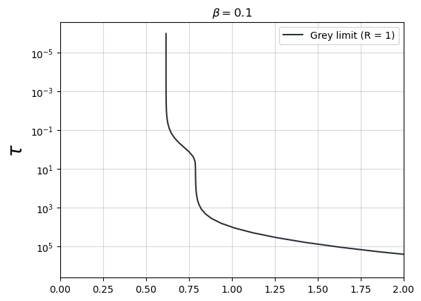
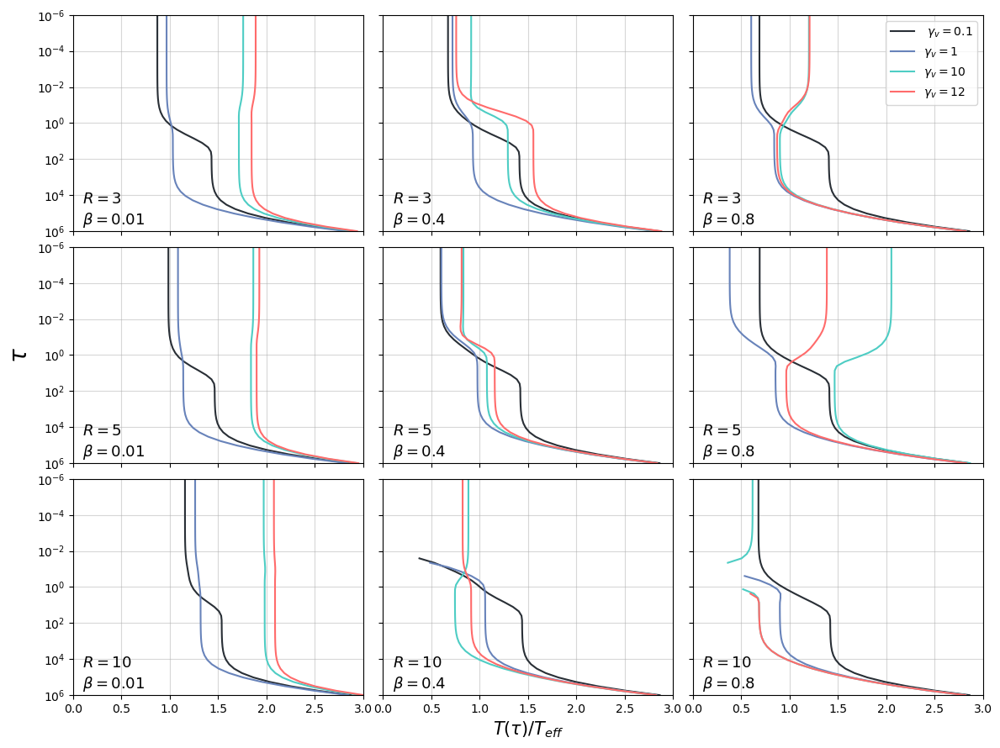
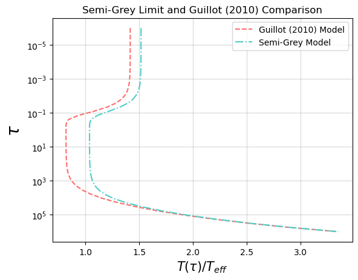

# Major Project Logbook
## Author Nathan Hancock

### Task 1 - Locate literature values for the state of the exoplanet

The main three parameters of the exoplanet we need is the effective temperature $T_{eff}$, Albedo, gravity $g$ and density $\rho$.

The exoplanet type of interest is a gas giant, specifically jupiter like. In Sanchez-Lavega et al., 2019, the paper goes into the general properties of the gas giants within our solar systems. Temperatures range considerably based on the planet type looked at, for the icy giants like Neptune and Uranus, $T_{eff}$ are nearly identical sitting at 59.3K and 59.1K respectively whereas there is a considerable difference in $T_{eff}$  for Jupiter and Saturn having 
$T_eff$ of 124.4K and 95K respectively.


https://ntrs.nasa.gov/api/citations/20190001263/downloads/20190001263.pdf

# 2/9/2025 - Understanding the Major Project Topic

Goal is to read through the textbook chapter 17 to get a better understanding/grasp of the project topic and potential ways of tackling the project. I will also discuss main terms like the grey/gray atmosphere, LTE, etc. to improve my understanding of these terms.

Chapters are from the 'Theory of Stellar Atmospheres' by Ivan Hubeny and Dimitri Milhalas

## Chapter 17.7 - Models with External Irradiation

### Exact Solution (linearization method)
This chapter discusses mainly stellar atmospheres, but most likely most of the content can be used for exoplanet atmospheres.

For numerical models, external irradiation is easily added by making external rays be non-zero, i.e. make specific intensity at the surface ($\tau = 0$) with negative $\mu$ be non-zero. This will change the Feautrier variables j and h which are defined within the definitions section.

Using the definition of the Feautrier variable j at the upper boundary, we have the new boundary condition  (17.224):

$$\mu (\delta j_{\mu\nu}/\delta\tau_\nu)_0 = j_{\mu\nu}(\tau_\nu = 0) - \xi^-_{\nu} $$

$$\mu (\delta j_{\mu\nu}/\delta\tau_\nu)_0 = j_{\mu\nu}(\tau_\nu = 0) - I_{\mu\nu}^{ext}$$

Multiplying both sides by $\mu$ and integrating from 0 to 1 gives:

$$\frac{\delta K}{\delta\tau_\nu} = \int^1_0j_{\mu\nu}(\tau_\nu = 0) - \mu I_{\mu\nu}^{ext} = \int^1_0j_{\mu\nu}(\tau_\nu = 0) - H_\nu^{ext}$$

From this we can obtain an exact solution for the model in LTE, though we can also achieve an approximate solution using the grey atmosphere. 

### Pseudo-grey model (p. 628)

As this is a grey model, all variables operate irrelevant to frequency, this is gone into more detail within the definitions section. The frequency independent moment equations are:

$$dH/dz = - (\kappa_J J - \kappa_B B)\; \; \;  first \; moment \; DE$$
$$dK/dz = -\chi_H H \; \; \; second \; moment \; DE$$

where $\kappa_J$ and $\kappa_B$ are the absorption mean and the Planck mean opacities. As this system is thermodynamic equilibrium, the first moment differential equation must be 0 by the definition of the eddington flux H as $H \equiv \sigma_R T_{eff}^4/4\pi$, thus $dH/dz \equiv 0$. Therefore the mean intensty is linked to the planck function:

$$B = (\kappa_J/\kappa_B)J$$


 We need all three moments for the model, the zeroth moment J (the mean intensity) by solving the second moment DE:

$$K(\tau_H) = H\tau_H + K(0), \; \;\; \tau_H = -\chi_H dz $$

$\tau_H$ is the optical depth associated with the flux mean opacity. Substituting $H = B$ and $K = fJ$ where $f$ is the Eddington factor $f \equiv K/J$:

$$J(\tau_H) = \left[\frac{\sigma_R T_{eff}^4}{4\pi} \tau_H + K(0)\right] \times \frac{1}{f}$$

Taking the two stream approximation (p. 572 - 573), the moments of radiative transfer are defined as:

$$J(\tau) = \frac{1}{2}[I^+(\tau) + I^-({\tau})]$$

$$H(\tau) = \frac{\mu_0}{2}[I^+(\tau) - I^-({\tau})]$$

$$K(\tau) = \frac{\mu_0^2}{2}[I^+(\tau) + I^-({\tau})]$$

At $\tau = 0$:

$$ H(0) = \frac{\mu_0}{2}[I^+(0) - I^-(0)]$$

Rearranging:

$$I^+ = I^- + 2H(0)/\mu_0 = I^{ext} + 2H_0/\mu_0$$

Subsitituting into $K(\tau)$ at $\tau = 0$:

$$K(0) =\frac{\mu_0^2}{2}[I^+(0) + I^-({0})] = \mu_0^2[I^{ext} + H_0/\mu_0] $$

The book defines the external radiation as the Planck distribution at an irradiation temperature $T_{irr}$ multiplied by a dilution factor $W$. Substituting this into the equation for $J(\tau_H)$:

$$J(\tau_H) = \left[\frac{\sigma_R T_{eff}^4}{4\pi} \tau_H + \mu_0^2[WB(T_{irr}) + H_0/\mu_0]\right] \times \frac{1}{f}$$

$f = \mu_0^2$ from the definition of $f$ and $K(\tau)$ allows us to simplify 

$$J(\tau_H) = \left[\frac{\sigma_R T_{eff}^4}{4\pi f} \tau_H + W(\sigma_R/\pi) T_{irr}^4+ H_0/\mu_0\right]$$

The temperature profile can be approximated to:

$$T^4(\tau_H) = \frac{\kappa_J}{\kappa_B}\left[\frac{3}{4}T_{eff}^4\left(\frac{1}{3f}\tau_H + \frac{1}{3g}\right) + WT^4_{irr}\right]$$


The irradiation temperature 

## Definitions
### Feautrier Method and Feautrier variables (11.76, 11.83, 11.148)
Requires two boundary conditions, in the textbook, they use a squashed I like symbol, I could not find the exact one in latex so I will choose a different one to supplement it ($\xi$). The boundary conditions for the Feutrier method for a finite planar slab is:

$$I_\nu(\tau_\nu = 0, -\mu) \equiv \xi_\nu^-(-\mu), \;\;\;\;\; (0 \leq \mu \leq 1)$$

$$I_\nu(\tau_\nu = \tau_0, \mu) \equiv \xi_\nu^+(\mu), \;\;\;\;\; (0 \leq \mu \leq 1)$$

These boundary conditions are strictly met for the Feautrier method, two variables j and h are defined for the upper boundary as:

$$h_{\mu\nu}(\tau = 0) = j_{\mu\nu}(\tau = 0) - \xi_\nu^-(0,-\mu), \;\;\; (0\leq\mu\leq1)$$

This is taken from the form of the Milne boundary conditions at 11.83 within the textbook where h and j are specific intensity. If there was no external radiation, $\xi_\nu^-(0,-\mu) \equiv 0$, for this case then:

$$h_{\mu\nu}(\tau = 0) \equiv j_{\mu\nu}(\tau = 0)$$

Then:

$$\mu (\delta j_{\mu\nu}/\delta\tau_\nu)_0 = j_{\mu\nu}(\tau_\nu = 0) $$

### Grey/Gray atmosphere

The grey atmosphere approximation is a simplification of stellar atmospheres by the assumption that absorption in the atmosphere is costant irrespective of frequency. 

### Local Thermodynamic Equilibrium

Simplification of atmospheric models, assumes that the state of gas in a small region is in thermodynamic equilibrium. The overall system does not need to be in thermodynamic equilibrium but the individual small regions do. LTE systems are also commonly used with the plane parallel approximation where each slab is essentially parallel to each other with no curvature.

### Moments of Radiative Transfer

A part of the Eddington approximation, a simplification of the fist three moments of radiative transfer which are the mean intensity J, the Eddington flux H and the K-integral K. The moments are defined as:

$$J_\nu = \frac{1}{2}\int^1_{-1} I_\nu d\mu$$
$$H_\nu = \frac{1}{2}\int^1_{-1} I_\nu \mu d\mu$$
$$K_\nu = \frac{1}{2}\int^1_{-1} I_\nu \mu^2 d\mu$$

The Eddington approximation assumes that intensity is isotropic and that the intensity is a linear function of $\mu= \cos\theta$. 

### Radiative mean and Planck mean opacities

The Planck mean opacity weights the absorption coefficient $\kappa_nu$ by the normalised planck distribution function:

$$\kappa_B = \frac{\int^\infty_0 \kappa_\nu B d\nu}{\int^\infty_0 Bd\nu} = \frac{\pi}{\sigma_K T^4} \int^{\infty}_0 \kappa_\nu Bd\nu$$

Radiative mean opacity 


## Meeting at 2pm

Group meeting we had at 2pm, we found equaition for mixing paramter W, it is given by the ratio of the radius of the star with the distance to the planet:

$$W = \left(\frac{R_*}{D}\right)^2f$$

Where $f = \mu_0^2$.

Job given to me for to work on: Read through the following paper and summarise the parts we need to make a non-grey atmospheric model while Vernica works on solving the optical depth $\tau_H$ for the pseudo-grey model and while Griff codes up the pseudo-grey model.

A non-grey analytical model for irradiated atmospheres. I: Derivation
https://arxiv.org/abs/1311.6597

There is a second paper, will look at this as well:

A non-grey analytical model for irradiated atmospheres. II: Analytical vs. numerical solutions
https://arxiv.org/abs/1311.6322


# 4/9/2025 - Literature research for non-grey atmosphere model

9:36am

Looking for papers on 2/9, I found one that is well cited and discusses a derivation for a non-grey model for an irradiated atmosphere of an exoplanet. This session I will aim to read through as much of the paper as I can before the scheduled meeting with the group at 2pm

Paper read:

This will be added to the group Zotero so we can keep track of all the papers read

## Premise of paper (Abstract and 1)

Pseudo-grey models, like the one we have used for the initial model, are useful for approximating irradiated atmospheres of stars like brown dwarfs, but overestimate temperatures at low optical depths for exoplanets.

The paper will discuss the limiting factors of the pseudo-grey model and adjust the model for a more accurate atmospheric structure with a focus on correcting opacity in the infrared.

In the plot below, the paper compares a non-grey numerical model to pseudo grey models. The pseudo grey model for optical depths above order unity align with the non-grey model quite well, with isochrones matching the shape of the numerical model. Below the order unity the pseudo-grey models fail and models that fit well in the high optical depth deviate substantially in the low optical depth.

The paper aims to add non-grey cooling effects within the upper atmosphere to the 


## Definitions (2.1)

### Radiative transfer equation (2.1.1)

For the paper, they consider a plane-parallel atmosphere in LTE that recieves both an external thermal flux $\sigma_KT^{4}_{irr}$ at an angle of $\mu$ and an internal isotropic flux from below the atmosphere $\sigma_K T^{4}_{int}$.

The paper decribes effective temperature $T_{eff}$ as the sum of the external and internal temperature:

$$ T_{eff}^4 = T_{int}^4 + \mu T_{irr}^4$$

The radiative transfer equation for the problem:

$$-\mu\frac{dI_{\mu\nu}}{dm} = \kappa_\nu I_{\nu\mu} - \kappa_\nu B_\nu(T)$$

This has to be solved for all frequencies and angles, with $dm = \rho dz$. This equation has triple depencencies of $\mu$, $\nu$ and $T$ which is too complex. 


# 10/9/2025 - Continuation of reading

# 2 - Models for comparison to the non-grey model

### Optical Depths and Opacities (2.1.2)

They need to simplify the model, the first choice is the opacities. A simplified model would find themselves using the Rosseland mean opacity $\kappa_R$ which they define as:

$$\frac{1}{\kappa_R} = \int_0^\infty \frac{1}{\kappa_\nu} \frac{\delta B_\nu(T)}{\delta T} d\nu$$

This opacity is used when at all wavelengths the mean free path of photons is small compared to the scale height of the atmosphere. Using the mean opacity, the definition of optical depth becomes:

$$d\tau= \kappa_R dm$$

This is solved assuming hydrostatic equilibrium, so $dm = \frac{dP}{g}$

The other opacity they use is the planck mean opacity $\kappa_P$ which is defined as:

$$\kappa_P = \int_0^\infty \kappa_\nu B_\nu(T)d\nu$$

They then define $\gamma_P$ as the ratio of the two opacities which was seen in the pseudo-grey model:

$$\gamma_P = \frac{\kappa_P}{\kappa_R}$$

For a grey atmosphere, $\gamma_P = 1$, but for a non-grey atmosphere, $\gamma_P > 1$. This is due to the Rossland opacity being weighted towards low opacity regions, while the Planck mean is weighted towards high opacity regions by the $\kappa_\nu$ term in each definition.

They also define the opacity for stellar flux as $\kappa_v$ as the collimated flux from the star is absorbed at different atmospheric layers. They also link this opacity to the Rosseland mean opacity with a ratio $\gamma_v$:

$$\gamma_v = \frac{\kappa_v}{\kappa_R}$$


### Picket Fence model (2.1.3)

#### From Textbook (17.6 - Line blanketing and picket fence model)
This is discussed within the textbook at chapter 17.6 about line blanketing. The main three needed parameters for the line spctrum of a stellar atmosphere are the temperature, surface gravity and chemical composition/metalicity. Early models were innadiquate as the opacity of materials had large variation at photoionisation edges and spectral lines. Additionally, there is the inward increase in temperature that causes a steeper temperature gradient than a grey atmosphere would predict due to the backwarming effect. These effects coupled with the complexity of chemical composition of stars on spectral lines in a stars opacity is referred to as line blanketing.

An statistical approach to the line blanketing problem is the picket fence model derived by Chandrasekhar. The model assumes that the continuum is in LTE and it's opacity is constant/independent over frequency. The other assumption is that the lines do not overlap and have square profiles, and the final assumption is that the lines are uniformly distributed over frequency.

This leads to the picket fence shaped plot of opacity over frequency

#### From Paper

The paper uses the picket fence model as two different sets of opacities with different wavelength dependencies may have the same Rosseland mean opacity and Planck mean opacity. The picket fence model is to constrain the model further by defining two new opacities that thermal opacities can take $\kappa_1$ and $\kappa_2$:

$$\kappa_\nu = \kappa_1 \; for \; \nu \in [n\Delta \nu, \; n\Delta \nu + \delta \nu]$$

$$\kappa_\nu = \kappa_2 \; for \; \nu \in [n\Delta \nu + \delta\nu, (n+1)\Delta\nu]$$

$$n \in [1,N]$$


$\beta$ is defined as the bandwidth:

$$\beta = \frac{1}{\int_0^\infty B_\nu d\nu}\sum_{n=1}^N \int_{n\Delta \nu}^{n\Delta \nu + \delta \nu} B_\nu d\nu$$

In the paper they choose the planck function as constant over the distance between two lines $\Delta \nu$, so $\beta$ becomes:

$$\beta \equiv \frac{\delta \nu}{\Delta \nu}$$

The Rosseland mean opacity becomes:

$$\kappa_R = \frac{\kappa_1\kappa_2}{\beta\kappa_2 + (1-\beta)\kappa_1}$$

The Planck mean opacity becomes:
$$\kappa_P = \beta \kappa_1 + (1-\beta)\kappa_2$$

And similar to before, the paper defines more ratios of opacities:

$$\gamma_1 \equiv \frac{\kappa_1}{\kappa_R}$$

$$\gamma_2 \equiv \frac{\kappa_2}{\kappa_R}$$

$$R \equiv \frac{\kappa_1}{\kappa_2} = \frac{\gamma_1}{\gamma_2}$$

They set a limit on the optical depth following the Chandrasekhar picket fence model:

$$\tau_{lim} \equiv \frac{1}{\gamma_1\gamma_2} \sqrt{\frac{\gamma_P}{3}}$$

#### My understanding of the picket fence model

Looking at both the textbook and the paper, I think I understand the picket fence model. It is a way to simplify complex line opacities if the goal isn't to model the exact spectrum but instead simulate the effects of line blanketing on atmopheric structure as a whole such as the temperature profile.

# 11/9/2025 - Continuation of reading

## Discrete Ordinate Methods (2.2)

The paper goes on to discuss the different discrete ordinate methods to approximate the integrals for the radiative transfer equation. They use it for the different approiximaate models for atmospheric structure and why they don't work for the externally irradiated atmosphere.

### Grey Atmosphere (2.2.1)

They do a Gaussian sum over the angles $\mu$ and sum up to 4 terms. Precision can be increased by adding more terms. They set the boundary condition as simply that the specific intensity of rays leaving the atmosphere at $\tau = 0$ is zero, that is $I_{\mu<0}(\tau=0) = 0$. The 4th order solution is:

$$T(\tau)^4 = \frac{3}{4}T_{int}^4(\tau + Q + L_1e^{k_1\tau} + L_2e^{k_2\tau} + L_3e^{k_3\tau})$$

Where $[Q,k_1,k_2,k_3]$ are constants. This leads to the definition of skin temperature as the temperature at $\tau = 0$:

$$T_{skin}^4 = (\frac{\sqrt{3}}{4})T_{int}^4$$

This model only works for atmospheres with no external irradiation.

### Non-grey case (2.2.2)

Developed by Chandrasekhar (1960) that takes the grey atmosphere model and adds a perturebation to include non-grey thermal effects. The model is limited to only small deviations from the grey case and required high precision numerical methods to solve or very large deviations that can be solved analytically. The paper employs the picket fence model in conjunction with the second order approximation for the angular dependency that gives the following solution:

$$T(\tau)^4 = \frac{3}{4}T_{int}^4 \left[\frac{1}{\sqrt{3\gamma_P}} + \tau + \frac{(\sqrt{\gamma_P} - \gamma_1)(\sqrt{\gamma_P} - \gamma_2)}{\gamma_1\gamma_2\sqrt{\gamma_P}}(e^{-\tau/\tau_{lim} - 1})\right]$$

Similar to the grey case, the skin temperature is defined as:

$$T_{skin}^4 = \frac{\sqrt{3}}{4\sqrt{\gamma_P}}T_{int}^4$$

The grey case occurs when $\gamma_P = 1$ where the two skin temperatures are equal.

## Moment Equations Method (2.3)

This is the method we have used for the pseudo-grey model that Vernica and Griff are coding up while I plan for the non-grey model. I will read through this section to see if there is any major departure from what we have done. 

### 2.3.1 Equations for the momentum of radiation intensity

The paper derives the moment equations from the radiative transfer equation as was done by Eddington (1916). This gives the following:

$$\frac{dH_\nu}{d\tau_\nu} = J_\nu - B_\nu(T)$$

$$\frac{dK_\nu}{d\tau_\nu} = H_\nu $$

This is the same as what the textbook has in chapter 17.7 (see notes from 2/9/2025) but instead of writing the moment equations in terms of $z$ they use optical depth $\tau_\nu$. This just eliminates the opacities and extinction terms from the equations by grouping them into the optical depth term.

Assuming radiative equilibrium, the first DE becomes:

$$\int_0^\infty \kappa_\nu (J_\nu - B_\nu) d\nu = 0$$

For the grey model, the frequency depenency of the opacity is removed and $\kappa_\nu$ becomes $\kappa_R$ and can be taken out of the integral. This leads to the same conclusion as before that $J = B$.

For a frequency dependent opacity, the solutions for the DE's have four unknowns and not closed. A closure relation is needed to relate the moments to each other, a common one is the Eddington approximation $J_\nu = 3K_\nu$. The approximation is usable for two cases: an isotropic radiation field and in the two stream approximation.

### 2.3.2 Boundary conditions


## 3 - Analytic irradiated non-grey picket fence model

### 3.1 Equations

Using the opacities defined in chapter 2.1.2 of the paper where the thermal opacities were defined as dependent on $\kappa_\nu$, coupling with a picket fence model means that there are three opacties that the model will depend on $\kappa_1$, $\kappa_2$ and $\kappa_v$. Additionally, the difference between thermal and visible channels depends on the angular dependency, not the frequency. Integrating the moment equations gives:

$$\frac{dH_{(1,2)}}{d\tau} = \gamma_{(1,2)}J_{(1,2)} - \gamma_{(1,2)}(\beta, 1-\beta)B(T)$$

$$\frac{dK_{(1,2)}}{d\tau} = \gamma_{(1,2)}H_{(1,2)}$$


The planck function is constant over each bin, that is $B_1 = \beta B(T)$ and $B_2 = (1-\beta)B(T)$. The paper assumes the Eddington approximation is valid in the to bands, that is $J_{(1,2)}=3K_{(1,2)}$. This leads to the following second order DE's by combining the two moment equations:

$$\frac{d^2J_1}{d\tau^2} = 3\gamma_1(J_1 - \beta B) \;\;\;\;\; (1)$$
$$\frac{d^2J_2}{d\tau^2} = 3\gamma_2(J_2 - (1-\beta) B) \;\;\;\;\; (2)$$

The radiative equilibrium equation:

$$\gamma_1 J_1 + \gamma_2 J_2 + \gamma_v J_v = \gamma_P B \;\;\;\;\;\;(3)$$

The paper denotes quantities with v as the momentum of the incident stellar radiation. Assuming the radaiation is collimated and arrives at an angle $\mu_* = \cos\theta_*$, the moment equations for the visible radiation are:

$$(J_\nu, H_\nu, K_\nu) = (1, \mu_*, \mu_*^2)I_*$$

where $I_*$ is the total incident intensity:

$$I_* = \int_0^\infty I_{*\nu} d\nu$$

Absorption of stellar radiation is given by the following:

$$J_v(\tau) = -\frac{H_v(0)}{\mu_*}e^{-\gamma_v^*\tau} \; \; where \; \gamma_v^*\equiv \gamma_v/\mu_*$$

Equation 1 - 3 are coupled equations, the following two variables are defined to decouple them:

$$J_\gamma \equiv \frac{J_1}{\gamma_1} + \frac{J_2}{\gamma_2}$$

$$J_{\gamma^3} \equiv \frac{J_1}{\gamma_1^3} + \frac{J_2}{\gamma_2^3}$$

Combining this with equation (1), (2) and (3) gives the following:

$$ \frac{d^2J_\gamma}{d\tau^2} = -3\gamma_vJ_v \;\;\;\; (4)$$

$$\frac{d^2J_{\gamma^3}}{d\tau^2} = 3(J_\gamma - B) \;\;\;\; (5)$$

Equation (3) becomes a linear equation:

$$ B = \frac{\gamma_1^2 + \gamma_2^2}{\gamma_P}J_\gamma - \frac{(\gamma_1\gamma_2)^2}{\gamma_P}J_{\gamma^3} + \frac{\gamma_v}{\gamma_P}J_v \;\;\;\; (6)$$

(4), (5) and (6) are now two decoupled equations and a linear equation. Defining boundary conditions allows for the solution of the system.


# 13/9/2025 - Continuation of reading

### 3.2 Boundary conditions

To solve the system of equations, boundary conditions are needed. First the high optical depth BC, i.e. $\tau \rightarrow \infty$. When $\tau$ approaches infinity, the system should approach the diffusion approximation $J_\nu = B_\nu$.

For $\tau \rightarrow 0$, the boundary condition sets the geometry of the system by setting the mean intensity and the Eddington flux of the thermal opacities to be:

$$J_{(1,2)}(0) = 2H_{(1,2)}(0)$$

### 3.3 Solution

The solution for the system of equations in the paper and is nearly two pages of algebra which will take way too much time to type out and would be unnecessary as it would essentially be copying the paper. The final solution for the temperature profile also is quite long, but will be written below as it will be used for the programming of the model:

$$T^4(\tau) = \frac{3}{4}T^4_{int} (\tau + A + Be^{-\tau/\tau_{lim}}) + \frac{3}{4}T_{irr}^4\mu(C + De^{-\tau/\tau_{lim}} Ee^{-\gamma_v^* \tau})$$

Where A, B, C, D and E are constants defined in the paper which themselves are made up of coefficients, this will be copied from the paper as well for the programming of the model:

$$A = \frac{1}{3}(a_0 + a_1b_0)$$
$$B = -\frac{1}{3}\frac{(\gamma_1 \gamma_2)^2}{\gamma_p} b_0$$
$$C = -\frac{1}{3}[b_0b_1(1 + b_2 + b_3)a_1 + a_2 + a_3]$$
$$D = \frac{1}{3}\frac{(\gamma_1 \gamma_2)^2}{\gamma_P}b_0 b_1 (1 + b_2 + b_3)$$
$$E = \frac{[3 - (\gamma_v^*/\gamma_1)][3 - (\gamma_v^*/\gamma_2)]}{9\gamma_v^*[(\gamma_v^*\tau_{lim})^2 - 1]}$$

Where:

$$a_0 = \frac{1}{\gamma_1} + \frac{1}{\gamma_2}$$
$$a_1 = -\frac{1}{3\tau_{lim}^2} \left[\frac{\gamma_P}{1 - \gamma_P}\frac{\gamma_1 + \gamma_2 - 2}{\gamma_1 + \gamma_2} + (\gamma_1 + \gamma_2)\tau_{lim} - (A_{t,1} + A_{t,2})\tau_{lim}^2\right]$$

$$a_2 = \frac{\tau_{lim}^2}{\gamma_P \gamma_v^{*2}} \frac{(3\gamma_1^2 - \gamma_v^{*2}) (3\gamma_2^2 - \gamma_v^{*2}) (\gamma_1 + \gamma_2) - 3\gamma_v^{*2}(6\gamma_1^2\gamma_2^2 - \gamma_v^{*2}(\gamma_1^2 + \gamma_2^2))}{1 - \gamma_v^{*2}\tau_{lim}}$$

$$a_3 = - \frac{\tau_{lim}^2(3\gamma_1^2 - \gamma_v^{*2})(3\gamma_2^2 - \gamma_v^{*2})(A_{v,2} + A_{v,1}) }{\gamma_P\gamma_v^{*3}(1 - \gamma_v^{*2}\tau_{lim}^2)}$$

$$b_0 = \left(\frac{\gamma_1 \gamma_2}{\gamma_1 - \gamma_2} \frac{A_{t,1} - A_{t,2}}{3} - \frac{(\gamma_1 \gamma_2)^2}{\sqrt{3\gamma_P}} - \frac{(\gamma_1\gamma_2)^3}{(1 - \gamma_1)(1 - \gamma_2)(\gamma_1 + \gamma_2)}\right)$$

$$b_1 = \frac{\gamma_1 \gamma_2 (3\gamma_1^2 - \gamma_v^{*2})(3\gamma_2^2 - \gamma_v^{*2})\tau_{lim}^2}{\gamma_P\gamma_v^{*2} (1 - \gamma_v^{*2}\tau_{lim}^2)} \$$

$$b_2 = \frac{3(\gamma_1 + \gamma_2)\gamma_v^{*2}}{(3\gamma_1^2 - \gamma_v^{*2})(\gamma_2^2 - \gamma_v^{*2})}$$

$$b_3 = \frac{A_{v,2} - A_{v,1}}{\gamma_v^*(\gamma_1 - \gamma_2)}$$

And the final coefficients are defined as:

$$A_{t,i} = \gamma_i^2\ln\left(1 + \frac{1}{\tau_{lim}\gamma_i}\right)$$
$$A_{v,i} = \gamma_i^2 \ln \left(1 + \frac{\gamma_v^*}{\gamma_i}\right)$$

## Using the model


That's the full solution, the model can be modified/varied over two pairs of paramters, specifically $(\beta,R)$ and $(\tau_{lim}, \gamma_P)$. Noted in previous parts of the reading, $\beta$ and $R$ dictate the behaviour of the picket fence model, specifically the ratio of line width $\delta\nu$ to line spacing $\Delta\nu$ and the ratio of the opacities of the thermal lines $\kappa_1$ to the thermal continuum $\kappa_2$ respectively:

$$\beta = \frac{\delta\nu}{\Delta\nu}, \;\;\; R = \frac{\kappa_1}{\kappa_2}$$

These will dictate the thermal opacities of the model, whereas changing the optical depth limit of the picket fence model $\tau_{lim}$ and ratio of the mean opacities $\gamma_P$ will change the overall shape of the entire temperature profile. Depending on which values are manipulated, they can be used to define the other pair of variables (i.e. if $(\beta, R)$ are given, then $(\gamma_1, \tau_{lim})$ and almost all other variables can be calculated).


The final major issue is that the Roselland mean opacity itself can't be calculated from other coefficients and the visible opacities are also needed. Determination of the visible opacities and inserting them into the model will be a challenge, Vernica is currently trying to get the opac code from Mike's github to give us these opacities but there is no guarantees that this might even be compatible/work with the model and cause a large amount of problems that can't be solved before the deadline. I'll start the coding over the next few days to see if I can get a basic version of the model in python and then we can try to add the opacities later if we can get them.


# 17/9/2025 - Starting the model coding
Python was the best choice for the model, I started by initially defining all of the args for the .py file so that the constants could be changed easily from the command line. Some constants were not clear in the paper, the first was their definition of the effective temperature $T_{eff}$. The paper defines it as:

$$T_{eff}^4 = T^4_{int} + \mu T^4_{irr}$$

This is problematic for us as we had set the irradiation temperature for the semi-grey model that Vernica and Griff are coding as the effective temperature of the sun, though in the textbook, this is multiplied by a dilution factor W. Earlier in the project, we found the dilution factor is defined as:

$$W = \left( \frac{R_*}{D_*}\right)^2 \times \mu^2$$

I think this paper has already mutiplied the irradiating source temperature by the dilution factor W and just called it $T_{irr}$. This means that the effective temperature is actually:

$$T_{eff}^4 = T^4_{int} + \mu W T^4_{eff \; *}$$

Therefore, initial arguments for the model are (as of writing this) with default values using the argparse package:

```python
parser = argparse.ArgumentParser()  # Sets up argparse package to define and check for arguments

# Effective surface temperature of planet in Kelvin  
parser.add_argument("--T_eff", required=False, type=int, default=143) 

# Effective radiation of the sun in kelvin for irradiation temperature
parser.add_argument("--T_eff_sun", required=False, type=int, default=6500) 

# Cosine of angle of incident radiation, default is 1 (normal incidence)
parser.add_argument("--mu", required=False, type=float, default=1) 

# Determines which variable system is used
# If True: Changing thermal opacities, variables become R and beta.
# If False: Changing overall profile, variables become kappa_P and tau_lim
parser.add_argument("--modelParamChange", required=False, type=bool, default=True)

# Ratio of Thermal line and continuum opacities kappa_1 kappa_2                                      
parser.add_argument("--R", required=False, type=float, default=0.1) 

# Partitioning of thermal opacity between two channels 
parser.add_argument("--beta", required=False, type=float, default=0.5) 

# Optical depth limit for picket fence model
parser.add_argument("--tau_lim", required=False, type=float, default=100) 

# Ratio of Planck mean thermal opacity to Roeseland mean visible opacity kappa_P/kappa_v
parser.add_argument("--gamma_P", required=False, type=float, default=0.4) 

# Checks if set up args are present in run line, if not sets default values
args = parser.parse_args() 

```
These are the initial arguments, argparse was used so that arguments could be implimented and have default values if not included in the call in the command line. 

This may also get expanded as I continue to code for any potential additions that are needed. The command line functionality may be unnecessary at a later date or requires too much work to make it functional as I can just build edit values in the code for testing the model, but for now this is a start.

Next part is the main coefficients, specifically defining the temperatures $T_{int}$ and $T_{irr}$ and the opacity ratios. First the main temperatures and other simple coefficients:

```python
# -- Coeffients -- #

    gamma_v = kwargs.get('gamma_v') # Visible opacity (to be provided by vernica)

    tau = np.logspace(-6, 6, 50) # Optical depth array

    mu = kwargs.get('mu', 1) # angle of incidence of incoming radiation

    # Calculate temperature profile coefficients
    T_eff_sun = kwargs.get('T_eff_sun', 6500*u.K) # Irradiation temperature in Kelvin
    
    T_eff = kwargs.get('T_eff', 144*u.K)

    W = (kwargs.get('R_star', c.R_sun)/kwargs.get('D', 5.2*u.AU))**2 * mu**2

    T_irr = W * T_eff_sun

    T_int = (T_eff**4 - T_irr**4)**(1/4)

```


Next is the variables, this is outlined in page 9 ofthe paper.

If $\beta$ and $R$ are the coefficients that are being changed, then:

$$\gamma_P = \beta + R - \beta R + \frac{\beta + R - \beta R}{R} - \frac{(\beta + R - \beta R)^2}{R} $$

$$\tau_lim = \frac{\sqrt{R}\sqrt{\beta(R-1)^2 - \beta^2(R - 1)^2 + R}}{\sqrt{3}(\beta + R - \beta R)^{2}} $$

If $\tau_{lim}$ and $\gamma_P$ are the variables that are being changed, then:

$$R = \frac{\sqrt{3\gamma_P} + 3\gamma_P \tau_{lim} + \sqrt{\Delta}}{\sqrt{3\gamma_P} + 3\gamma_P\tau_{lim} - \sqrt{\Delta}}$$

$$ \beta = \frac{\sqrt{\Delta} - \sqrt{3\gamma_P} + 3\gamma_P\tau_{lim}}{2\sqrt{\Delta}}$$

$$\Delta = 3\gamma_P + 3\sqrt{\gamma_P}\tau_{lim}(2\sqrt{3}\gamma_P + 3\gamma_P^{3/2}\tau_{lim} - 4\sqrt{3})$$


Irrelevant to what is chosen, $\gamma_1$ and $\gamma_2$ can either be defined in terms of either coefficients. For simplicity, I have opted to use the $R$ and $\beta$ definition:

$$\gamma_1 = \beta + R - \beta R$$
$$\gamma_2 = \frac{\beta + R - \beta R}{R}$$

Coding this up will take some time, will update once done.

# 21/9/2025 - Continuing coding of model

Delayed in continuing model due to research program deadlines, but the next part of the model was coded up, specifically the part from page 9 of the paper. There needs to be a check to see whether the user wants to change the thermal opacities or the overall profile of the atmosphere. This is done with a boolean variable `modelParamChange` which if true, changes the thermal opacities and if false, changes the overall profile. The code for this is below:

```python

    # Based on which paramters are being changed for the model, define the other 
    # parameters accordingly
    if kwargs.get('modelParamChange', True) == True:
    
        # Get parameters from kwargs or set defaults
        
        beta = kwargs.get('beta', 0.5)
        R = kwargs.get('R', 0.1)

        gamma_P = beta + R - beta*R + (beta + R - beta*R)/R - (beta + R - beta*R)**2/R
        tau_lim = (np.sqrt(R)*np.sqrt(beta*(R-1)**2 - beta**2 *(R - 1)**2 + R))/(np.sqrt(3)*(beta + R - beta*R)**2)
    
    else:
        # Get parameters from kwargs or set defaults
        gamma_P = kwargs.get('gamma_P', 0.4)
        tau_lim = kwargs.get('tau_lim', 100)

        # Calculate other params for model
        delta = 3*gamma_P + 3*np.sqrt(gamma_P) * tau_lim*(2*np.sqrt(3)*gamma_P + 3*gamma_P**(3/2)*tau_lim - 4*np.sqrt(3))

        R = (np.sqrt(3*gamma_P) + 3*gamma_P*tau_lim + np.sqrt(delta)) / (np.sqrt(3*gamma_P) +3*gamma_P*tau_lim - np.sqrt(delta))
        beta = (np.sqrt(delta) - np.sqrt(3*gamma_P) + 3*gamma_P*tau_lim)/(2*np.sqrt(delta))
    
    # Calculate gamma_1 and gamma_2
    gamma_1 = beta + R - beta*R
    gamma_2 = (beta + R - beta*R)/R

```

For the next part, the rest of the coefficients need to be defined. The main issue is the visible opacities. From what I understand from what Vernica has told me, this will be a matrix for the visible opacities, with rows being the different opacities at different wavelengths and the columns being the opacities at different optical depths. Therefore I would need to sum the second half of the temperature profile over all visible opacities at each step of the optical depth array. This is something that will need to be discussed with Vernica to see how best to implement this. For now, I will set up a loop that will roughly try to do this and will need to be fixed later.

```python
    # Calculate sub-coefficients for temperature profile coefficients (from page 8 and pretty ugly, sorry)
    A_t_1 = gamma_1**2 * np.log(1 + 1/(tau_lim*gamma_1))
    A_t_2 = gamma_2**2 * np.log(1 + 1/(tau_lim*gamma_2))
    
    a_0 = 1/(gamma_1) + 1/(gamma_2)

    a_1 = -1/(3*tau_lim**2) * ( (gamma_P)/(1-gamma_P) * (gamma_1 + gamma_2 - 2)/(gamma_1 + gamma_2) +
             (gamma_1 + gamma_2)*tau_lim - (A_t_1 + A_t_2)*tau_lim**2)
    
    b_0 = ((gamma_1*gamma_2)/(gamma_1 - gamma_2) * (A_t_1 - A_t_2)/3 - (gamma_1*gamma_2)**2/np.sqrt(3*gamma_P) 
            - (gamma_1*gamma_2)**3/((1-gamma_1) * (1-gamma_2) * (gamma_1 + gamma_2))   )**-1
    
    A = 1/3 * (a_0 + a_1*b_0)

    B = -1/3 * (gamma_1*gamma_2)**2*b_0/gamma_P

    # Coefficients that depend on visible opacity
    for i in range(0,len(gamma_v[0,:])):
    
        A_v_1 = gamma_1**2 * np.log(1 + gamma_v/gamma_1)
        A_v_2 = gamma_2**2 * np.log(1 + gamma_v/gamma_2)

        a_2 = tau_lim**2/(gamma_P*gamma_v**2) * ( (3*gamma_1**2 - gamma_v**2) * (gamma_1 + gamma_2) -
            3*gamma_v*(6*gamma_1**2*gamma_2**2 - gamma_v**2*(gamma_1**2 + gamma_2**2)))/(1 - gamma_v**2*tau_lim)

        a_3 = -(tau_lim**2 * (3*gamma_1**2 - gamma_v**2) * (A_v_2 + A_v_1))/(gamma_P*gamma_v**3 * (1 - gamma_v**2*tau_lim**2))
        
        b_1 = gamma_1*gamma_2*(3*gamma_1**2 - gamma_v**2)*(3*gamma_2**2 
            - gamma_v**2)*tau_lim/(gamma_P*gamma_v**2*(gamma_v**2*tau_lim**2 - 1))
    
        b_2 = 3*(gamma_1 + gamma_2)*gamma_v**3/(gamma_P*gamma_v**2*(gamma_v**2*tau_lim**2 -1))

        b_3 = (A_v_2 - A_v_1)/(gamma_v*(gamma_1 - gamma_2))
    

        
    
        C = -1/3 * (b_0*b_1*(1 + b_2 + b_3)*a_1 + a_2 + a_3)

        D = 1/3 * (gamma_1*gamma_2)**2/gamma_P * b_0*b_1*(1 + b_2 + b_3)

        E = (3 - (gamma_v/gamma_1)**2)*(3 - (gamma_v/gamma_2)**2)/(9*gamma_v*((gamma_v*tau_lim)**2 - 1))
```

# 24/9/2025 - Continuing coding of model
Fixing up the loop of visible opacities was the main goal, but this may also be another issue as the ratio $\gamma_v$ becomes extremely large, especially at low optical depths (looking at an order of magnitude of 1e44) which python and specifically numpy does not like. I am planning to set the goal of making the model take basic values of visible opacity ratios to see if the model works fundamentally before trying to add complexity. Modifying the code from 21/9:

```python

    # Coefficients that depend on visible opacity
    T_visible = 0

    for i in range(0,len(gamma_v)):
    
        A_v_1 = gamma_1**2 * np.log(1 + gamma_v[i]/gamma_1)
        A_v_2 = gamma_2**2 * np.log(1 + gamma_v[i]/gamma_2)

        a_2 = tau_lim**2/(gamma_P*gamma_v[i]**2) * ( (3*gamma_1**2 - gamma_v[i]**2) * (gamma_1 + gamma_2) -
            3*gamma_v[i]*(6*gamma_1**2*gamma_2**2 - gamma_v[i]**2*(gamma_1**2 + gamma_2**2)))/(1 - gamma_v[i]**2*tau_lim)

        a_3 = -(tau_lim**2 * (3*gamma_1**2 - gamma_v[i]**2) * (A_v_2 + A_v_1))/(gamma_P*gamma_v[i]**3 * (1 - gamma_v[i]**2*tau_lim**2))
        

        b_1 = gamma_1*gamma_2*(3*gamma_1**2 - gamma_v[i]**2)*(3*gamma_2**2
            - gamma_v[i]**2)*tau_lim/(gamma_P*gamma_v[i]**2*(gamma_v[i]**2*tau_lim**2 - 1))

        b_2 = 3*(gamma_1 + gamma_2)*gamma_v[i]**3/(gamma_P*gamma_v[i]**2*(gamma_v[i]**2*tau_lim**2 -1))

        b_3 = (A_v_2 - A_v_1)/(gamma_v[i]*(gamma_1 - gamma_2))
    

        
    
        C = -1/3 * (b_0*b_1*(1 + b_2 + b_3)*a_1 + a_2 + a_3)

        D = 1/3 * (gamma_1*gamma_2)**2/gamma_P * b_0*b_1*(1 + b_2 + b_3)

        E = (3 - (gamma_v[i]/gamma_1)**2)*(3 - (gamma_v[i]/gamma_2)**2)/(9*gamma_v[i]*((gamma_v[i]*tau_lim)**2 - 1))

        T_visible += 3*T_irr**4* mu/4*(C + D*np.exp(-tau/tau_lim) + E*np.exp(-gamma_v[i]*tau))
    
    T_all_opacities = 3*T_int**4/4 * (tau + A + B*np.exp(-tau/tau_lim)) + T_visible
    

    # -- Temperature Profile -- #
    # Define optical depth array
    

    # Define temperature profile
    # NOTE: the irradiated part can be expanded for more optical opacities, sum that part for each gamma_v

    T = (T_all_opacities)**(1/4)

    return T
```

This also needs work, I think I have done the summation incorrectly but it should work for just a single visible opacity ratio. I will test this with some basic values of R with fixed beta to see how the model looks.

I have also transitioned from using argparse to inputting the values directly using kwargs, I opted to do this as Vernica will directly import the function defined and call it within her own code, so argparse would lead to unnecessary complications. The -h for the function outlines the kwargs that can be used.

```python
def nonGreyModel(**kwargs):
    """
    Function for non-grey atmospheric model.
    Based on the work of Parmentier & Guillot (2014)
    Keyword arguments have default values, but can be changed if you want by defining them before calling the function.
    Additionally, there are args for the script that can be set when running the script from the command line


    kwargs
    -----------
    T_eff: float
        Effective temperature of planet in Kelvin.
        default is 144K (Jupiter-like)
    T_eff_sun : float
        Effective temperature of sun in Kelvin.
        default is 6500K (solar irradiation)
    kappa_v : array
        Visible opacity in cm^2/g

    mu : float
        Cosine of angle of incidence of incomming radiation
        Values of between 0 to 1
    R_star : float
        Radius of irradiating star
        default is 1 solar radius
    d : float
        Distance of irradiating star to exoplanet
        default is 5.2 AU (Jupiter distance to sun)
    gamma_v : array
        Ratio of visible opacity to Roeseland mean thermal opacity kappa_v/kappa_R
        This should be an array of values for different visible opacities
        default is np.array([1])


  
    modelParamChange : bool
        if True: Changing thermal opacities, variables become R and beta
        if False: Changing overall profile, variables become kappa_P and tau_lim
    
    R : array
        Ratio of Thermal line and continuum opacities kappa_1/kappa_2
        Only used if modelParamChange is True
    beta : array
        Partitioning of thermal opacity between two channels
        Only used if modelParamChange is True

        
    tau_lim : float
        Optical depth limit for picket fence model
        Only used if modelParamChange is False
    gamma_P : float
        Ratio of Planck mean thermal opacity to Roeseland mean visible opacity kappa_P/kappa_R
        Only used if modelParamChange is False

```


## Initial Testing of the model

The model was initially tested over an array of R values with a fixed beta of 0.01 so that the model aligns with values from the paper to test if the function works as intended. The R ratio was tested from 0.01 to 1e4 with steps of 100. There was an initial issue, the grey limit where R = 1 causes the code to fail due to division by zero errors. This occurs in the definition of `a_0` and `gamma_P`, where by the fact that R = 1 causes `gamma_P` to be 1 and therefore the denominator in `a_0` becomes zero by $1/(1-\gamma_P)$. The paper does have a defined grey limit to counteract this, but I opted to just skip R = 1 for the time being, though I will place a check for the grey limit in the code later so that the model can be compared to the grey case.

Ignoring the grey limit, the model runs fine if it is only given a single visible opacity ratio. I knew this was most likely to happen as I most certainly had screwed up the simmation of the visible opacities. It's something that will need to be fixed later, but for now I will just test with the single visible opacity of 10 as was used for the paper in figure 4. Below is the code used to initially test the model:

```python
    tau = np.logspace(-6, 6, 50)

    R = np.arange(0.5, 1e4, 100)
    for i in R:
        if i == 1:
            continue
        kwargs = {
        "T_eff": 144*u.K,
        "T_eff_sun": 6500*u.K,
        "mu": 1/np.sqrt(3),
        "gamma_v": [0.25],
        "modelParamChange": True,
        "R": i,
        "beta": 0.01,
        "tau_lim": None,
        "gamma_P": None,
        "d": 5.2*u.AU,
        "R_star": c.R_sun
        }

        Temp_profile = nonGreyModel(**kwargs)/kwargs['T_eff']/u.K
        plt.plot(Temp_profile, tau, '-r', alpha = 0.3)
    

    R = [0.5]
    for i in R:
        if i == 1:
            continue
        kwargs = {
        "T_eff": 144*u.K,
        "T_eff_sun": 6500*u.K,
        "mu": 1/np.sqrt(3),
        "gamma_v": [0.25],
        "modelParamChange": True,
        "R": i,
        "beta": 0.01,
        "tau_lim": None,
        "gamma_P": None,
        "d": 5.2*u.AU,
        "R_star": c.R_sun
        }

        Temp_profile = nonGreyModel(**kwargs)/kwargs['T_eff']/u.K
        plt.plot(Temp_profile, tau, '-k', label = '$R = {:.1f}$'.format(i))

    R = [1e4]
    for i in R:
        if i == 1:
            continue
        kwargs = {
        "T_eff": 144*u.K,
        "T_eff_sun": 6500*u.K,
        "mu": 1/np.sqrt(3),
        "gamma_v": [0.25],
        "modelParamChange": True,
        "R": i,
        "beta": 0.01,
        "tau_lim": None,
        "gamma_P": None,
        "d": 5.2*u.AU,
        "R_star": c.R_sun
        }

        Temp_profile = nonGreyModel(**kwargs)/kwargs['T_eff']/u.K
        plt.plot(Temp_profile, tau, '-b', label = '$R = {:.1f}$'.format(i))
    
    
    plt.ylabel("Optical Depth $\\tau$")
    plt.xlabel("$T(\\tau)/T_{eff}$")
    plt.yscale('log')
    plt.ylim(1e-6, 1e2)
    plt.legend()
    plt.xlim(0,2.3)
    plt.gca().invert_yaxis()
    plt.show()

```

There were some unnecessary loops in the boundary line plotting, but thats due to just copying and pasting the kwargs and plotting from the first case to the boundary cases. The plot that is produced is below, it accurately follows the shape of the plot in the paper and shows that the model works for different values of R. The red line is R = 0.5 is extremely close to the grey limit of R = 1 where there should be no thermal cooling at low optical depths as the picket fence is technically removed at the grey limit.




Comparing to the model from the paper, specifically the solid red line in figure 4 of the paper shows that the shape of our model is very accurate, though does rapidly diverge at the high optical depths though I assume this is due to the temperatures we have chosen. We had chosen a Jupiter like planet, both in terms of effective temperature and distance to the star. This could also be due to the visible opacity being so low, remembering that the opacity ratio that initially was seen from Vernica was at values of 1e44.




Though a new issue arised, changing the visible opacity ratio does not change the plot in any way (or any way that is noticable). Not sure why this is happening, I will need to look into why this is happening. A high visible opacity should cause the temperature to increase from the grey model at low optical depths, but it being stationary suggests that the visible opacity is not being included in the model correctly.

# 2/11/2025 - Continuing coding of model

I have been attempting to implement the visible opacities by Vernica for nearly a week, there has been several issues that have come up, specifically issues with numpy arrays, astropy units and the fact that several of the opacities when divided by the Roselland mean opacity give extremely tiny ratios (1e-277) causing python to return 0s. These 0s cause division by zero errors in the code, troubleshooting this has taken a long time, but I got the code working. The summation part of the visible opacities was written:
```python
    T_visible = []
    print(gamma_P)

    m = 0
    
    for i in range(0,len(tau)):
        m+=1
    
        gamma_v = kwargs.get('gamma_v') # Visible opacity
        tau = np.logspace(-6, 6, 50) # Optical depth array

        
        a = np.where((gamma_P * gamma_v[:,i]**2) == 0)
  

        x = np.delete(gamma_v[:,i],a[0])
        len(gamma_v[:,i])

        if len(x) == 0:
            T_visible.append(0)
            continue
        

        A_v_1 = gamma_1**2 * np.log(1 + gamma_v[:,i]/gamma_1)
        A_v_2 = gamma_2**2 * np.log(1 + gamma_v[:,i]/gamma_2)


        a_2 = tau_lim**2/(gamma_P*gamma_v[:,i]**2) * ( (3*gamma_1**2 - gamma_v[:,i]**2) * (gamma_1 + gamma_2) -
            3*gamma_v[:,i]*(6*gamma_1**2*gamma_2**2 - gamma_v[:,i]**2*(gamma_1**2 + gamma_2**2)))/(1 - gamma_v[:,i]**2*tau_lim)
        

        

        a_3 = -(tau_lim**2 * (3*gamma_1**2 - gamma_v[:,i]**2) * (A_v_2 + A_v_1))/(gamma_P*gamma_v[:,i]**3 * (1 - gamma_v[:,i]**2*tau_lim**2))


        b_1 = gamma_1*gamma_2*(3*gamma_1**2 - gamma_v[:,i]**2)*(3*gamma_2**2
            - gamma_v[:,i]**2)*tau_lim/(gamma_P*gamma_v[:,i]**2*(gamma_v[:,i]**2*tau_lim**2 - 1))

        b_2 = 3*(gamma_1 + gamma_2)*gamma_v[:,i]**3/(gamma_P*gamma_v[:,i]**2*(gamma_v[:,i]**2*tau_lim**2 -1))

        b_3 = (A_v_2 - A_v_1)/(gamma_v[:,i]*(gamma_1 - gamma_2))


        
    
        C = -1/3 * (b_0*b_1*(1 + b_2 + b_3)*a_1 + a_2 + a_3)

        D = 1/3 * (gamma_1*gamma_2)**2/gamma_P * b_0*b_1*(1 + b_2 + b_3)

        E = (3 - (gamma_v[:,i]/gamma_1)**2)*(3 - (gamma_v[:,i]/gamma_2)**2)/(9*gamma_v[:,i]*((gamma_v[:,i]*tau_lim)**2 - 1))

        T_visible_tau = np.sum( 3*T_irr**4* mu/4*(C + D*np.exp(-tau[i]/tau_lim) + E*np.exp(-gamma_v[:,i]*tau[i]) )).value


        T_visible.append(T_visible_tau)
    print(T_visible)


    T_all_opacities = 3*T_int**4/4 * (tau + A + B*np.exp(-tau/tau_lim)) + T_visible*u.K**4
```

This was the main part of the code that was changed, but in the end, all of the effort was in vain as now the produced plots look like this:


This is so clearly jibberish, so now I am making the decision to revert back to the arbitrary opacities.

After testing arbitrary values, the code is still spitting out incorrect plots at similar values, T_visible is giving extremely high values at all optical depths, I don't seem to know why but will try and get the code back to the way it was. I've gotten the code back to the way it was before I tried to implement the visible opacities, it looks like it was due to the .value at the end of the T_visible_tau line, this was added as numpy was considering the multiplication with tau unit error, but the T_visible_tau line did not simplify the units correctly, so I was getting a value of m**8 K**4/AU**8. This could make the opacities from vernica work,
but the issue of the high optical depth ratios still remains. There will be a massive disjoint when it gets to that point so it might be best to just use arbitrary values for now.


### Update at 20:34

After trying for hours, I can't seem to get the model to produce anything that looks like the Guillot paper, I can get the Chandrasekhar model to work but not this one. 

I have tried changing the $\beta$ and R values, but all they change is the low optical depth part of the profile. The high optical depth part is always the same, basically going to extremely high temperatures and always following the same shape.

The paper states that it uses the semi-grey limit, but I can't find any information on the model for the semi-grey case. They have provided an equation from Guillot for the semi-grey case.

On the bright side I have managed to get Vernica's opacities to work, see below:




# 3/11/2025 - Continuing coding of model

Fialising some plots for the presentation, below is one of the final plots:



Manipulating the R and beta values changes only the low optical depth part, still can't get the high optical depth part to change. 

I'll try some more, but the other plot I'm planning to do is a comparison between the Chandrasekhar model and this model. I did see a line in regards to the Guillot model, but I think that is just the model taken from the Guillot paper, not the Parmentier and Guillot one this project is based on.

## Reading through the Guillot (2010) paper

Guillot defines the irradiation temperature as

$$T_{irr} = T_* (R_*/D)^{1/2}$$

This is different to the definition we got from online searching where the $R/D$ was squared instead of rooted. This could be the issue, but new issues arise where the numbers get extremely large for the visible part of the temperature profile. Changing this in the code causes it to break, where temperatures from the irradiation part go to extremely large values (1e6 K) and sometimes negative values causing nan errors. This is probably why the visible opacities aren't affecting the plot, the irradiation temperature/visible part must be essentially going to 0, so the model then only produces non-grey non-externally irradiated atmospheres.

#### Confirmation

The plot below was produced when T_irr = 0


So the mixing factor is wrong, but then the rest of the code breaks when T_irr is defined the same as from Guillot (2010), producing the following plots


After proofreading the code for the visible part, I found several mistakes, these were corrected and updating the plot now yields



Which is still wrong, even the grey case is not going to the higher optical depths. The problem seems to be the definition of the temperatures. Taking example temperature from the first paper gives the following plot



This is now giving a realistic model, but this is just the grey case from Guillot(2010), this doesn't take into account the new visible opacities and the picket fence opacities. 

Further investigation leads me to believe that it is the limit of optical depth, the nan values occur due to the R and beta values causing the optical depth limit to be too high and the nan values occur at tau values above the tau limit. The paper puts a heatmap for the tau limits.

### 20:30

The model works for the most part with the different R and beta values, but does become unstable at high R values, specifically R > 10. Regardless, this is a working model, I have made a plot testing different R, beta and visible opacity ratios:



I just need to make 2 more plots, specifically the heatmap of tau limits and a grey limit comparison between this model and the Guillot (2010) model and a comparison of the non-externally irradiated case with the Chandrasekhar model.


# 4/11/2025 - Finalising plots for presentation

Adjusted effective temperature to $T_{eff}^4 = T_{int}^4 + T_{irr}^4/4$ to be in line with Guillot (2010) and Parmentier & Guillot (2014).


### Guillot (2010) Model

The Guillot (2010) model is defined as:

$$T^4 = \frac{3T_{int}^4}{4} \left( \frac{2}{3} + \tau \right) + f\frac{3T_{irr}^4}{4} \left( \frac{2}{3} + \frac{1}{\gamma\sqrt{3}} + (\frac{\gamma}{\sqrt{3}} - \frac{1}{\gamma\sqrt{3}})e^{-\gamma\sqrt{3}\tau} \right)$$

This is for angles of $\mu = 1/\sqrt{3}$ as the analytical model can only be solved for this angle. $f$ is the Eddington coefficient, which is 1/2 for the dayside average and 1/4 for the global, isotropic average.

The goal is to code the two Eddington coefficients and compare them to the non-grey model at the semi-grey limit R = 1.

### Final attempts

I've tried hard coding the R = 1 case, but there is still a considerable discrepancy which the paper's plot does not have, still can't figure out the issue. The plot below is the best I can get it to look like:



I did notice a difference in notation by the papers, where $\gamma_v^* = \gamma_v/\mu$. It shouldn't make any difference for the other parts that I have plotted, but it was an issue for the semi-grey limit. The plot above is after fixing this, so it didn't fix the issue. 

The main issue is the T_irr part, it becomes large at high gamma, so large that it makes the T^4 part negative causing nan errors. I have tried several things, but nothing seems to work. As this is essentially the end of the project, I will proceed with the presentation with the plots that I have. It works for the no irradiation model and for limits of the non-grey externally irradiated model
