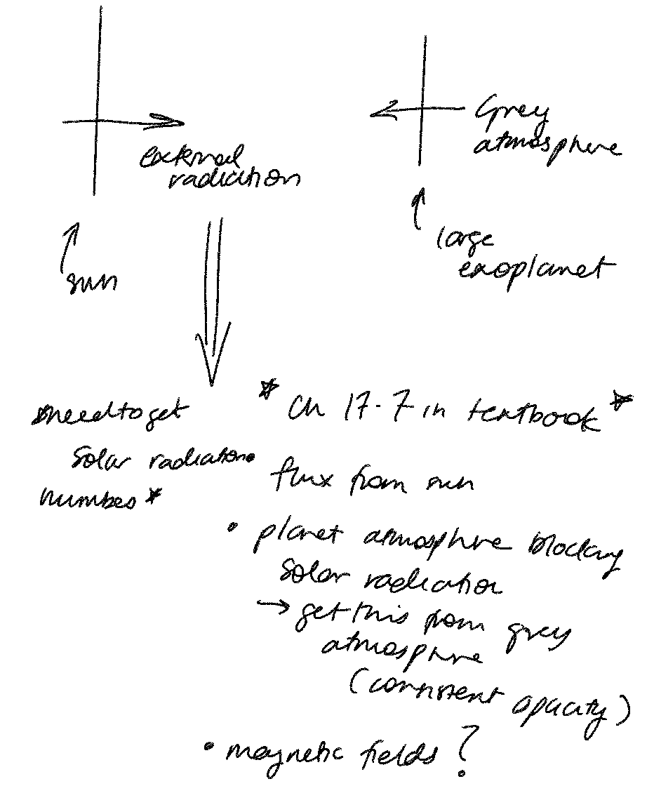

# Project 10 Group Logbook

## 26-08-2025

- Git repo has been set up, still ironing out some issues so that everyone can see everything
- Have discussed the problem and approaches, sketched out the plan and ideas as below

## 28 - 08 - 2025 - minutes from class time 3-5pm

- Zotero project created so we can easily group all sources together
- Discussing possible methods for tackling project
- Textbook has grey atmospher approximation for externally irradiated atmospheres
- planet structure considered to be gas giant, Vernica provided a paper that discusses processes of externally irradiated atmosphere of gas giant
    - Model from paper takes non-LTE effects into account, might be too complex of a starting point
- Looking at provided code, specifically structure.py file. We plan too look over the code to see how it works
- We aim to neglect convection due to the problem being too complex to add, possibly might come back to it if we have time.

For pseudo-grey model, we need to know the temp, g and rho of planet. Albedo of the planet remains fixed and will come from literature. We aim to find how the temperature of the planet is affected by the external radiation field.

We discuss 3 main tasks to split between the three of this:

- Fixing the temperature code so that it works
- Finding literature values for temperature, g and density of exoplanets
- Changing code so that it becomes an exoplanet instead of a star

## 02 - 09 - 2025 - notes from group meeting

At this stage, we have a finalised equation for the simple pseudo-gray model planet atmosphere.

$$T^4(\tau_H)=\frac{\kappa_J}{\kappa_B}\frac{3}{4}T_{eff}^4\left[\tau_H+\frac{1}{\sqrt{3}}+\frac{4W}{3}\left(\frac{T_{irr}}{T_{eff}}\right)^4\right]$$

Where for the pseudo-gray atmosphere, $\kappa_J/\kappa_B=1$, and $W=(r_\ast/D)^2\times{f}$, where $f=1/2$ for the stellar radiation being evenly spread over the hemisphere of the planet. The only part we are unsure about at the moment is $\tau_H$, and we need to look further to understand exactly how it is dependent on the atmosphere of the exoplanet.

We have broken the next part of the project down into three components for us to work on this week:

- Griffin: finish the code for `T_tau`, where an input tau grid outputs temperature
- Vernica: look into $\tau_H$ and apply this to the function, testing the `structure.py` code to get some initial model results
- Nathan: look beyond the grey atmosphere model, into what we need to do to model non-grey atmosphere

## 11 - 09 - 2025 - notes from group meeting

Realised a couple of issues with grey model:

- kappa function defined in existing opac code done from only hydrogen but planet atmosphere mostly helium
  - need to redefine opacity function from first principle i.e. abundance * column density of species
- picket fence model for non-grey atmosphere
  - different way of defining T_Tau, much easier and computationally more viable than defining each individual absorption line
  - will also come up with opacities for non-grey model

For Tuesday, we have divided these two tasks up between the three of us, to try to get closer to a finished grey model and then make some steps towards the non-grey model.
